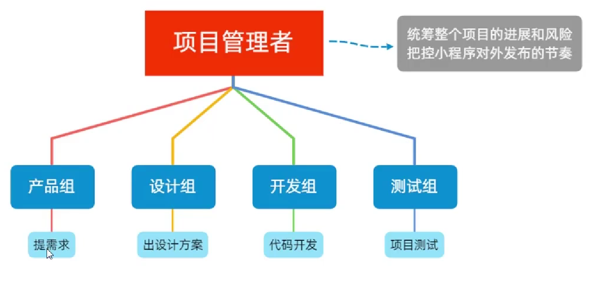
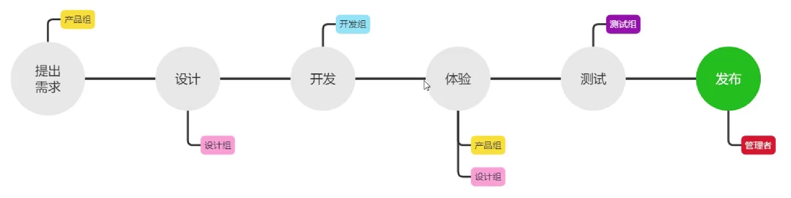

[toc]

# Day 01--起步

## 1 小程序基本结构

1. **pages 存放所用小程序页**（建议将所有页面存入其中）
2. utils 存放工具性质的模块
3. **app.js 小程序项目的入口文件**
4. **app.json 小程序的全局配置文件**
5. app.wxss 小程序项目的全局样式文件
6. project.config.json 项目的配置文件
7. sitemap.json 配置小程序是否被微信索引

## 2 pages 目录结构

下属有一个页面文件夹，由以下组成一个页面：

1. *.js 脚本文件，存放页面数据，处理事件函数
2. *.json 当前页面的配置文件，配置窗口外观，表现等
3. *.wxml 页面模板结构文件
4. *.wxss 页面样式表文件

## 3 JSON 配置文件

### 3.1 app.json

```json
{
  "pages": [
    "pages/index/index",
    "pages/logs/logs"
  ],
  "window": {
    "backgroundTextStyle": "light",
    "navigationBarBackgroundColor": "#fff",
    "navigationBarTitleText": "Weixin",
    "navigationBarTextStyle": "black"
  },
  "style": "v2",
  "sitemapLocation": "sitemap.json",
  "lazyCodeLoading": "requiredComponents"
}

```

存放当前小程序的**全局配置**，包括所有页面路径，窗口外观，界面表现，底部tab等

1. **pages** 用来记录当前小程序所有的页面路径
2. **window** 全局定义小程序所有页面的背景色
3. **style** 全局定义小程序的页面样式版本
4. sitmapLocation 指明sitmap.json的位置

### 3.2 project.config.json

```json
{
  "description": "项目配置文件",
  "packOptions": {
    "ignore": []
  },
  "setting": {
	...
  },
  "compileType": "miniprogram",
  "libVersion": "2.17.0",
  "appid": "wx9cb04c5161c18fad",
  "projectname": "demo01",
  "debugOptions": {
    "hidedInDevtools": []
  },
  "scripts": {},
  "staticServerOptions": {
	...
  },
  "isGameTourist": false,
  "condition": {
    ...
    }
  }
}
```

记录对小程序开发工具的所有个性化配置

1. setting 编译相关配置
2. projectname 项目名称
3. appid 小程序的账号id

### 3.3 sitmap.json

```json
{
  "desc": "关于本文件的更多信息，请参考文档 https://developers.weixin.qq.com/miniprogram/dev/framework/sitemap.html",
  "rules": [{
  "action": "allow",
  "page": "*"
  }]
}
```

配置小程序页面是否允许微信索引

更改project.config.json中`checkSiteMap`关闭控制台警告

### 3.4 每个页面中的json配置文件

对本页面窗口外观进行配置，页面中的配置项会覆盖app.json的`windows`中相同的配置项

## 4 页面管理

### 4.1 新增页面

若要新增页面，则在app.json的`pages`数组中新增，例

```json
 "pages": [
    "pages/index/index",
    "pages/logs/logs",
    "pages/list/list"
  ]
```

### 4.2 修改首页

调整 app.json 中 `pages` 数组顺序

## 5 WXML

类似网页开发中的HTML

### 5.1 WXML与HTML的区别

1. 标签名称不同
2. 属性节点不同
3. 提供了类似vue中的模板语法

## 6 WXSS

WXSS是一套样式语言，用于描述WXML的样式，类似于CSS

### 6.1 WXSS和CSS区别

1. 新增的rpx尺寸单位
2. 提供了全局样式和局部样式
3. WXSS仅支持部分CSS选择器

## 7 小程序中的JS文件

### 7.1 分类

1. app.js

   整个小程序的项目入口文件，通过调用`App()` 函数来启动小程序

2. 页面的js文件

   页面的入口文件，通过调用`Page()`函数来创建并运行页面

3. 普通的js文件

   普通的功能模块文件，用来封装公共的函数或者属性

## 8 宿主环境

### 8.1 什么是宿主环境

程序运行所必须依赖的环境，脱离宿主环境，软件没用任何意义

### 8.2 小程序的宿主环境

**手机微信**是小程序的宿主环境

### 8.3 小程序宿主环境包含的内容

1. 通信模型
2. 运行机制
3. 组件
4. API

## 9通信模型

### 9.1 通信的主体

小程序中通信的主体是渲染层和逻辑层其中：

1. WXML模板和WXSS样式工作在渲染层
2. JS脚本工作在逻辑层

### 9.2 通信模型

1. 渲染层和逻辑层的通信

   由微信客户端进行转发

2. 逻辑层和第三方服务器之间的通信

   由微信客户端进行转发

## 10 运行机制

### 10.1 小程序启动过程

1. 把小程序代码包下载到本地
2. 解析app.json全局配置文件
3. 执行app.js小程序入口文件，调用`App()`创建实例
4. 渲染小程序首页
5. 小程序启动完成

### 10.2 页面渲染过程

1. 加载解析页面的.json配置文件
2. 加载页面.wxml模板和.wxss样式
3. 执行页面.js文件，调用`Page()`创建页面实例
4. 页面渲染完成

## 11 组件

### 11.1 小程序组件分类

九类组件[小程序组件](https://developers.weixin.qq.com/miniprogram/dev/component/)

主要由以下几种：

1. 视图容器
2. 基础内容
3. 表单组件
4. 导航组件

### 11.2 常用视图容器类组件

#### 11.2.1 view

- 普通视图区域
- 类似HTML中的div，是一个块级元素
- 常用实现页面布局效果

##### view组件使用

```html
<!--pages/list/list.wxml-->
<view class="container1">
  <view>A</view>
  <view>B</view>
  <view>C</view>
</view>
```

```css
/* pages/list/list.wxss */
.container1 view{
  width: 100px;
  height: 100px;
  text-align: center;
  line-height: 100px;
}

.container1 view:nth-child(1){
  background-color: red;
}
.container1 view:nth-child(2){
  background-color: green;
}
.container1 view:nth-child(3){
  background-color: black;
}

.container1{
  display: flex;
  justify-content: space-around;
}
```

#### 11.2.2 scroll-view

- 可滚动的视图区域
- 用来实现滚动列表区域

##### score-view组件的使用

```html
<!--pages/list/list.wxml-->
<scroll-view class="container1" scroll-y>
  <view>A</view>
  <view>B</view>
  <view>C</view>
</scroll-view>
```

```css
.container1{
  border: 1px solid red;
  width: 100px;
  height: 120px;
}
```

#### 11.2.3 swiper和swiper-item

- 轮播图容器组件和轮播图item组件

##### swiper和swiper-item组件的基本使用

```html
<!-- 轮播图 -->
<swiper class="swiper-container">
  <!-- 第一个轮播图 -->
  <swiper-item>
    <view class="item">A</view>
  </swiper-item>
  <!-- 第二个轮播图 -->
  <swiper-item>
    <view class="item">B</view>
  </swiper-item>
  <!-- 第三个轮播图 -->
  <swiper-item>
    <view class="item">C</view>
  </swiper-item>
</swiper>
```

```css
.swiper-container {
  height: 150px;
}

.item {
  height: 100%;
  line-height: 150px;
  text-align: center;
}

swiper-item:nth-child(1) .item {
  background-color: green;
}

swiper-item:nth-child(2) .item {
  background-color: red;
}

swiper-item:nth-child(3) .item {
  background-color: black;
}
```

##### swiper常用属性

[swiper | 微信开放文档 (qq.com)](https://developers.weixin.qq.com/miniprogram/dev/component/swiper.html)

### 11.3 常用基础内容组件

#### 11.3.1 text

- 文本组件
- 类似HTML中的span标签，是一个行内元素

##### text组件基本使用

```html
<view>
  手机号支持常按选中效果
  <text selectable>133888886655</text>
</view>
```

#### 11.3.2 rich-text

- 富文本组件
- 支持把HTML字符串渲染为WXML结构

##### rich-text组件的基本使用

```html
<rich-text nodes="<h1 style='color:red;'>标题</h1>"></rich-text>
```

### 11.4 其它常用组件

#### 11.4.1 button

- 按钮组件
- 功能比HTML中button更加丰富
- open-type属性

##### button组件基本使用

```html
<!-- 通过type属性指定颜色 -->
<button>普通按钮</button>
<button type="primary">主色调按钮</button>
<button type="warn">警告按钮</button>

<!-- size="mini" 小尺寸按钮 -->
<button size="mini">普通按钮</button>
<button type="primary" size="mini">主色调按钮</button>
<button type="warn" size="mini">警告按钮</button>

<!-- palin 镂空按钮 -->
<button size="mini" plain>普通按钮</button>
<button type="primary" size="mini" plain>主色调按钮</button>
<button type="warn" size="mini" plain>警告按钮</button>
```

#### 11.4.2 image

- 图片组件
- image组件默认宽高约为300px，240px

##### image组件的基本使用

```html
<image></image>
<image src="/images/avatar.jpg"></image>
```

##### mode 属性

用来指定图片的裁剪缩放

[image | 微信开放文档 (qq.com)](https://developers.weixin.qq.com/miniprogram/dev/component/image.html)

#### 11.4.3 navigator

- 页面导航组件
- HTML中的a链接

## 12 API

### 12.1 API概述

小程序API由宿主环境提供，通过API，开发者可以方便调用微信提供的能力，例如：获取用户信息，本地存储，支付功能等

### 12.2 小程序API的三大分类

#### 12.2.1 事件监听API

- 特点：以`on`开头，用来监听事件的触发
- 举例：`wx.onWindowsResize(function callback)`监听窗口尺寸变化的事件

#### 12.2.2 同步API

- 特点1：以`Sync`结尾的API都是同步API
- 特点2：同步API的执行结果，可以通过函数返回值直接获取，如果执行出错会抛出异常
- 举例：`wx.setStroageSync('key',value)`向本地存储中写入内容

#### 12.2.3 异步API

- 特点：类似jQuery中的`$.ajax(option)`函数，需要通过success，fail，complete接受调用的结果
- 举例：`wx.request()`发起网络数据请求，通过success回调函数接受数据

## 13 协同工作

### 13.1 权限管理

[如何管理成员权限](https://www.bilibili.com/video/BV1834y1676P?p=14)

### 13.2 项目成员组织结构



### 13.3 小程序开发流程



