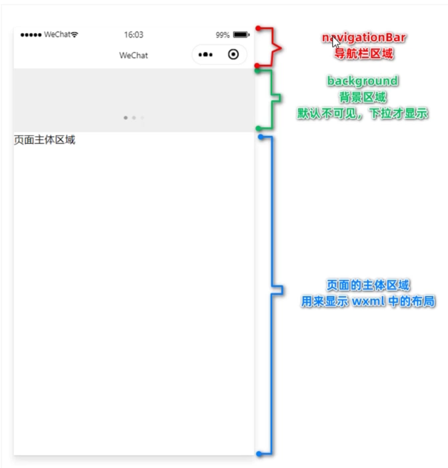
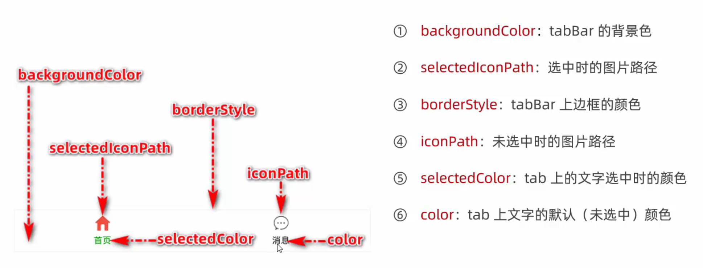
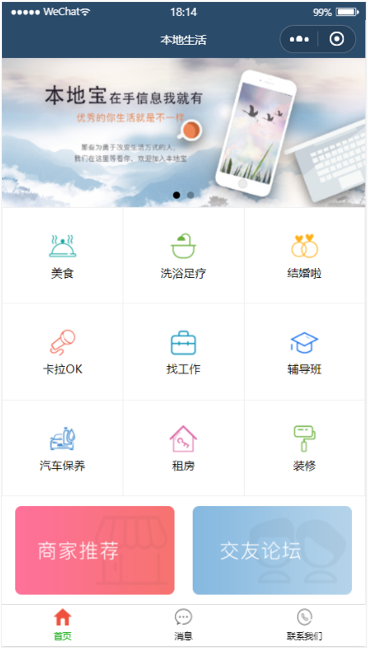

[toc]

# Day 02--模板与配置

## 1 WXML 模板语法

### 1.1 数据绑定

#### 1.1.1 基本原则

1. 在 data 中定义数据
2. 在 WXML 中使用数据

#### 1.1.2 定义数据

在页面对应的 js 文件中，把数据定义到 data 对象中

#### 1.1.3 Mustache 语法的格式

把 data 中的数据绑定到页面中渲染，使用 **Mustache 语法** （双大括号）将变量包裹起来

```js
  data: {
    info:'Hello World'
  }
```

```ht
<view>{{info}}</view>
```

#### 1.1.4 Mustache 语法的应用场景

##### 动态绑定内容

如上面代码

##### 动态绑定属性

```js
  data: {
    info:'Hello World',
    imgSrc:'/images/avatar.jpg'
  }
```

```html
<image src="{{imgSrc}}"></image>
```

##### 三元运算

```js
  data: {
    info:'Hello World',
    imgSrc:'/images/avatar.jpg',
    randNum:Math.random()*10
  }
```

```html
<view>{{randNum >=5 ? "大于或等于五":"小于5"}}</view>
```

可以通过调试器面板中的AppData查看所有定义数据

##### 算数运算

```js
  data: {
    info:'Hello World',
    imgSrc:'/images/avatar.jpg',
    randNum:Math.random()*10,
    randNum2:Math.random().toFixed(2)
  }
```

```html
<view>{{randNum2 *100}}</view>
```

### 1.2 事件绑定

#### 1.2.1 什么是事件

事件是**渲染层**到**逻辑层**的通讯方式

#### 1.2.2 小程序中常用的事件

1. tap--点击事件

2. input--文本框输入事件

3. change--状态改变时触发

#### 1.2.3 事件对象的属性

当事件回调触发时，会受到一个对象的 event

#### 1.2.4 target 属性和 currentTarget 属性

target是触发该事件的源头组件，currentTarget是当前事件所绑定的组件

#### 1.2.5 bindtap

##### bindtap 的语法格式

1. 通过 `bindtap` ，为组件绑定tap触摸事件

   ```html
   <button type="primary" bindtap="btnTapHandler">button</button>
   ```

2. 在页面 js 文件中定义对应事件的处理函数，事件参数通过形参event来接受

   ```javascript
   btnTapHandler(e){
     console.log(e);
   }
   ```

##### 在事件处理函数中为data中数据赋值

调用 `this.setData(dataObject)` 方法

```html
<button type="primary" bindtap="countChange">+1</button>
```

```javascript
Page({
  data: {
    count:0
  },
  countChange(){
    console.log('ok');
    this.setData({
      count:this.data.count+1
    })
  }
})
```

##### 事件传参

小程序中不能在绑定事件时传参

可以使用 `data-*` 自定义属性传参，其中`*`代表参数名字

```html
<button type="primary" bindtap="btnTap2" data-info="{{2}}">+2</button>
```

在事件处理函数中通过 `event.target.dataset.*` 即可获取到参数值

```javascript
btnTap2(e){
  this.setData({
    count:this.data.count+e.target.dataset.info
  })    
}
```

#### 1.2.6 bindinput

##### bindinput 的语法格式

同 bandtap

```html
<input bindinput="inputHandler"></input>
```

```javascript
inputHandler(e){
  console.log(e.detail.value);
}
```

##### 实现文本框和 data 、之间数据同步

1. 定义数据

   ```html
   <input value="{{msg}}" bindinput="inputHandler"></input>
   ```

2. 渲染结构

   ```js
   data: {
     msg:'hello',
   }
   ```

3. 美化样式

   ```css
   input{
     border: 1px solid #eee;
     padding: 5px;
     margin: 5px;
     border-radius: 3px;
   }
   ```

4. 绑定 input 事件处理函数

   ```js
   inputHandler(e){
     this.setData({
       msg:e.detail.value
     })
   }
   ```


### 1.3 条件绑定

#### 1.3.1 wx:if

在小程序中，使用 `wx:if="{{condition}}"` 来判断是否需要渲染该代码块，

也可以使用 `wx:if` 和 `wx:else` 来添加 else 判断

```html
<view wx:if="{{type===1}}">man</view>
<view wx:elif="{{type===2}}">woman</view>
<view wx:else="">secret</view>
```

#### 1.3.2 结合 \<block> 使用 wx:if

如果要**一次性控制多个组件的展示与隐藏**，可以使用一个  `<block></block>`  标签将组件包装起来，并在  \<block>  标签中使用 `wx:if` 控制属性 ，block并不是组件

```html
<block wx:if="{{true}}">
  <view>view1</view>
  <view>view2</view>
</block>
```

#### 1.3.3 hidden

在小程序中，直接使用 `hidden="{{ condition }}"` 也能控制组件的显示与隐藏 

```html
<view hidden="{{flag}}">条件为 true 时隐藏元素，否则显示</view>
```

#### 1.3.4 wx:if 与 hidden 的对比

1. 运行方式不同
   - wx:if 动态创建和移除元素
   - hidden 切换样式
2. 使用建议
   - hidden 频繁切换
   - wx:if 控制条件复杂

### 1.4 列表渲染

#### 1.4.1 wx:for

通过 `wx:for` 可以根据指定的数组，循环渲染重复的组件结构，默认情况下，当前循环项的索引用 index 表示；当前循环项永 item 表示 

```js
data: {
  arr1:['苹果','华为','小米']
}
```

```html
<view  wx:for="{{arr1}}">
  index: {{index}} item: {{item}}
</view>
```

#### 1.4.2 手动指定索引和当前项的变量名*

- 使用 `wx:for-index` 指定当前循环项索引
- 使用 `wx:for-item` 指定当前循环项

#### 1.4.3 wx:key 的使用

小程序实现列表渲染时，建议为渲染出来的列表项指定唯一的 key 值，从而提高渲染效率

```js
data: {
  userList: [{
      id: 1,
      name: '小红'
    },
    {
      id: 2,
      name: '小蓝'
    }, {
      id: 3,
      name: '小黄'
    }
  ]
}
```

```html
<view wx:for="{{userList}}" wx:key="id">{{item.name}}</view>
```

## 2 WXSS 模板样式

### 2.1 什么是 WXSS

用于美化 WXML 的一套样式语言，类似网页开发中的 CSS

### 2.2 WXSS 和 CSS 的关系

WXSS 具有 CSS 大部分特性，同时 WXSS 还对 CSS 进行了扩充以及修改，以适用微信小程序的开发。

与 CSS 相比， WXSS 扩展的特性有：

1. rpx 尺寸单位
2. @import 样式导入

### 2.3 rpx

#### 2.3.1 什么是 rpx

rpx 是微信小程序独有的，用来解决不同设备屏幕适配的问题

#### 2.3.2 rpx 实现原理

鉴于不同设备屏幕的大小不同，为了实现屏幕的自动适配， rpx 把所有设备的屏幕在宽度上等分为 750 份（即当前屏幕的总宽度为 750rpx ）

- 在较小设备上，1rpx 所代表宽度较小
- 在较大设备上，1rpx 所代表宽度较大

#### 2.3.3 rpx 与 px 之间的单位换算*

官方建议：开发微信小程序时，设计师可以用 iPhone6  作为视觉稿标准

开发举例：在 iPhone6 上如果要绘制宽 100px，高 20px 的盒子，换算成 rpx 单位，宽分别为 200rpx 和40 rpx 

### 2.4 样式导入

#### 2.4.1 什么是样式导入

使用 WXSS 提供的 `@import` 语法，可以导入外联的样式表

#### 2.4.2 `@import` 的语法格式

`@import` 后跟需要导入的外联样式表的相对路径，用**；**表示语句结束

```css
@import "/common/common.wxss";
```

### 2.5 全局样式和局部样式

#### 2.5.1 全局样式

定义在 app.wxss 中的样式为全局样式，作用于每一个页面

#### 2.5.2 局部样式

在页面的 .wxss 文件中定义的样式为局部样式，只作用于当前页面

注意：

1. 当局部样式和全局样式冲突时，根据就近原则，局部样式会覆盖全局样式
2. 当局部样式的权重大于或等于全局样式的权重使才会覆盖全局样式

## 3 全局配置

### 3.1 全局配置文件及常用的配置项

全局配置文件：根目录下的 app.json ，常用配置项如下：

1. **pages** 用来记录当前小程序所有的页面路径
2. **window** 全局定义小程序所有页面的外观
3. **tabBar** 设置小程序底部 tarBar 效果
4. **style** 全局定义小程序的页面样式版本

### 3.2 window 

#### 3.2.1 小程序的窗口组成部分



#### 3.2.2 了解 winsow 节点常用配置项

|          **属性名**          | **类型** | **默认值** |                    **说明**                    |
| :--------------------------: | :------: | :--------: | :--------------------------------------------: |
|    navigationBarTitleText    |  String  |   字符串   |               导航栏标题文字内容               |
| navigationBarBackgroundColor | HexColor |  #000000   |           导航栏背景颜色，如 #000000           |
|    navigationBarTextStyle    |  String  |   white    |   导航栏标题颜色，***仅支持 black / white***   |
|       backgroundColor        | HexColor |  #ffffff   |                  窗口的背景色                  |
|     backgroundTextStyle      |  String  |    dark    | 下拉 loading 的样式，***仅支持 dark / light*** |
|    enablePullDownRefresh     | Boolean  |   false    |              是否全局开启下拉刷新              |
|    onReachBottomDistance     |  Number  |     50     | 页面上拉触底事件触发时距页面底部距离，单位为px |

### 3.3 tabBar

#### 3.3.1 什么使 tabBar 

tabBar 是移动端应用常见的页面效果，用于实现多页面的快速切换，通常有底部 tabBar 和顶部 tabBar

注意：

1. tabBar 中只能配置最少 2 个最多 5 个tab 页签
2. 当渲染顶部 tabBar 使，不显示 icon，只显示文本

#### 3.3.2 tabBar 的 6 个组成部分  



#### 3.3.3  tabBar 节点配置项

|    **属性**     | **类型** | **必填** | **默认值** |                    **描述**                    |
| :-------------: | :------: | :------: | :--------: | :--------------------------------------------: |
|    position     |  String  |    否    |   bottom   |     tabBar 的位置，***仅支持 bottom/top***     |
|   borderStyle   |  String  |    否    |   black    | tabBar 上边框的颜色，***仅支持 black/white***  |
|      color      | HexColor |    否    |            |         tab 上文字的默认（未选中）颜色         |
|  selectedColor  | HexColor |    否    |            |            tab 上的文字选中时的颜色            |
| backgroundColor | HexColor |    否    |            |                tabBar 的背景色                 |
|     *list*      | *Array*  |   *是*   |     **     | *tab 页签的列表，  最少 2  个、最多  5 个 tab* |

#### 3.3.4 每个 tabBar 项的配置选项

|     **属性**     |   **类型**   | **必填** |                       **描述**                        |
| :--------------: | :----------: | :------: | :---------------------------------------------------: |
|  ***pagePath***  | ***String*** | ***是*** |     ***页面路径，页面必须在 pages  中预先定义***      |
|    ***text***    | ***String*** | ***是*** |                ***tab 上显示的文字***                 |
|     iconPath     |    String    |    否    | 未选中时的图标路径；当 postion 为 top 时，不显示 icon |
| selectedIconPath |    String    |    否    |  选中时的图标路径；当 postion 为 top 时，不显示 icon  |

```json
"tabBar": {
  "list": [
    {
      "pagePath": "pages/index/index",
      "text": "index"
    },
    {
      "pagePath":"pages/test/test",
      "text":"test"
    }
  ]
}
```

### 3.4 案例 - 配置 tabBar

```json
"tabBar": {
  "list": [{
    "pagePath": "pages/home/home",
    "text": "首页",
    "iconPath": "/images/tabs/home.png",
    "selectedIconPath": "/images/tabs/home-active.png"
  },
  {
    "pagePath": "pages/message/message",
    "text": "消息",
    "iconPath": "/images/tabs/message.png",
    "selectedIconPath": "/images/tabs/message-active.png"
  },
  {
    "pagePath": "pages/contact/contact",
    "text": "联系",
    "iconPath": "/images/tabs/contact.png",
    "selectedIconPath": "/images/tabs/contact-active.png"
  }
]
}
```

## 4 页面配置

### 4.1 页面配置文件作用

小程序中，每个页面都有自己的 .json 配置文件，用来对**当前页面**的**窗口**外观，页面效果等进行配置

### 4.2 页面配置文件和全局配置文件的关系

小程序中，app.json 中的 window 节点，可以全局配置小程序中每个页面的窗口表现。

如果某些小程序页面想要拥有特殊的窗口表现，此时，“页面级别的 .json 配置文件”就可以实现这种需求。

注意：当页面配置与全局配置冲突时，根据就近原则，最终的效果以页面配置为准。

### 4.3 页面配置中常用配置项

|           **属性**           | **类型** | **默认值** |                        **描述**                        |
| :--------------------------: | :------: | :--------: | :----------------------------------------------------: |
| navigationBarBackgroundColor | HexColor |  #000000   |           当前页面导航栏背景颜色，如 #000000           |
|    navigationBarTextStyle    |  String  |   white    |   当前页面导航栏标题颜色，***仅支持 black / white***   |
|    navigationBarTitleText    |  String  |            |               当前页面导航栏标题文字内容               |
|       backgroundColor        | HexColor |  #ffffff   |                  当前页面窗口的背景色                  |
|     backgroundTextStyle      |  String  |    dark    | 当前页面下拉 loading 的样式，***仅支持 dark / light*** |
|    enablePullDownRefresh     | Boolean  |   false    |            是否为当前页面开启下拉刷新的效果            |
|    onReachBottomDistance     |  Number  |     50     |    页面上拉触底事件触发时距页面底部距离，单位为 px     |

## 5 网络数据请求

### 5.1 小程序中网络数据请求的限制

1. 只能请求 HTTPS 类型的接口
2. 必须将接口的域名添加到信任列表中

### 5.2 配置 request 合法域名

需求描述：假设在自己的微信小程序中，希望请求 https://www.escook.cn/ 域名下的接口

配置步骤：登录微信小程序管理后台 -> 开发 -> 开发设置 -> 服务器域名 -> 修改 request 合法域名

注意事项：

1. 域名只支持 https 协议

2. 域名不能使用 IP 地址或 localhost

3. 域名必须经过 ICP 备案

4. 服务器域名一个月内最多可申请 5 次修改

### 5.3 发起 GET 请求

调用微信小程序提供的 wx.request() 方法，可发起 GET 数据请求

```js
getInfo(){
  wx.request({
    url: 'https://www.escook.cn/api/get',
    method: "GET",
    data: {
      name: 'zs',
      age: 25
    },
    success: (res) => {
      console.log(res.data);
    }
  })
}
```

#### 5.4 发起 POST 请求

```js
postInfo(){
  wx.request({
    url: 'https://www.escook.cn/api/post',
    method: "POST",
    data: {
      name: 'ls',
      age: 33
    },
    success: (res) => {
      console.log(res.data);
    }
  })
}
```

#### 5.5 在页面加载时请求数据

在页面的 `onLoad` 事件中调用获取数据的函数

```js
onLoad: function (options) {
  this.getInfo(),
  this.postInfo()
}
```

#### 5.6 **跳过** **request** 合法域名校验

详情 -> 本地设置

跳过 request 合法域名校验的选项，仅限在开发与调试阶段使用！

#### 5.7 关于跨域和 Ajax 的说明

跨域问题只存在于基于浏览器的 Web 开发中。由于小程序的宿主环境不是浏览器，而是微信客户端，所以小程序中不存在跨域的问题。

Ajax 技术的核心是依赖于浏览器中的 XMLHttpRequest 这个对象，由于小程序的宿主环境是微信客户端，所以小程序中不能叫做“发起 Ajax 请求”，而是叫做“发起网络数据请求”。

## 案例 - 本地生活（主页）

1. app.json

   ```json
   {
     "pages": [
       "pages/home/home",
       "pages/message/message",
       "pages/contact/contact"
     ],
     "window": {
       "backgroundTextStyle": "light",
       "navigationBarBackgroundColor": "#2b4b6b",
       "navigationBarTitleText": "本地生活",
       "navigationBarTextStyle": "white"
     },
     "tabBar": {
       "list": [{
           "pagePath": "pages/home/home",
           "text": "首页",
           "iconPath": "/images/tabs/home.png",
           "selectedIconPath": "/images/tabs/home-active.png"
         },
         {
           "pagePath": "pages/message/message",
           "text": "消息",
           "iconPath": "/images/tabs/message.png",
           "selectedIconPath": "/images/tabs/message-active.png"
         },
         {
           "pagePath": "pages/contact/contact",
           "text": "联系我们",
           "iconPath": "/images/tabs/contact.png",
           "selectedIconPath": "/images/tabs/contact-active.png"
         }
       ]
     },
     "style": "v2",
     "sitemapLocation": "sitemap.json",
     "lazyCodeLoading": "requiredComponents"
   }
   ```

2. home.wxml

   ```html
   <!--pages/home/home.wxml-->
   <!-- 轮播图区域 -->
   <swiper indicator-dots circular>
     <swiper-item wx:for="{{swiperList}}" wx:key="id">
       <image src="{{item.image}}"></image>
     </swiper-item>
   </swiper>
   
   <!-- 九宫格区域 -->
   <view class="grid-list">
     <view class="grid-item" wx:for="{{gridList}}" wx:key="id">
       <image src="{{item.icon}}">
   
       </image>
       <text>
         {{item.name}}
       </text>
     </view>
   </view>
   
   <!-- 图片区域 -->
   
   <view class="img-box">
   <image src="/images/link-01.png" mode="widthFix"></image>
   <image src="/images/link-02.png" mode="widthFix"></image>
   </view>
   ```

3. home.wxss

   ```css
   /* pages/home/home.wxss */
   
   swiper {
     height: 350rpx;
   }
   
   swiper image {
     width: 100%;
     height: 100%;
   }
   
   .grid-list {
     display: flex;
     flex-wrap: wrap;
     border-left: 1rpx solid #efefef;
     border-top: 1rpx solid #efefef;
   }
   
   .grid-item {
     width: 33.333333333%;
     height: 200rpx;
     display: flex;
     flex-direction: column;
     align-items: center;
     justify-content: center;
     border-right: 1rpx solid #efefef;
     border-bottom: 1rpx solid #efefef;
     box-sizing: border-box;
   }
   
   .grid-item image {
     width: 60rpx;
     height: 60rpx;
   }
   
   .grid-item text {
     margin-top: 10rpx;
     font-size: 24rpx;
   }
   
   .img-box {
     display: flex;
     padding: 20rpx 10rpx;
     justify-content: space-around;
   }
   
   .img-box image {
     width: 45%;
   }
   ```

4. home.js

   ```js
   // pages/home/home.js
   Page({
   
     /**
      * 页面的初始数据
      */
     data: {
       // 存放轮播图数据数组
       swiperList: [],
       // 存放九宫格数据
       gridList: []
     },
   
     /**
      * 生命周期函数--监听页面加载
      */
     onLoad: function (options) {
       this.getSwiperList(),
         this.getGridList()
     },
   
     // 获取轮播图数据的方法
     getSwiperList() {
       wx.request({
         url: 'https://www.escook.cn/slides',
         method: "GET",
         success: (res) => {
           console.log(res);
           this.setData({
             swiperList: res.data
           })
         }
       })
     },
   
     // 获取九宫格数据的方法
     getGridList() {
       wx.request({
         url: 'https://www.escook.cn/categories',
         method: "GET",
         success: (res) => {
           console.log(res);
           this.setData({
             gridList: res.data
           })
         }
       })
     }
   })
   ```


