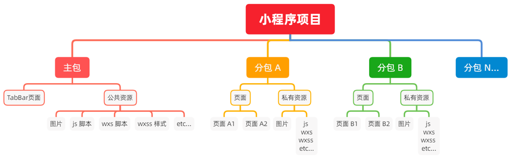

[toc]

# Day 05--基础加强

## 1 自定义组件

[自定义组件](day04.md)

## 2 使用 npm 包

目前，小程序中已经支持使用 npm 安装第三方包，从而来提高小程序的开发效率。但是，在小程序中使用 npm 包有如下 3 个限制：

1. 不支持依赖于 Node.js 内置库的包

2. 不支持依赖于浏览器内置对象的包

3. 不支持依赖于 C++ 插件的包

总结：虽然 npm 上的包有千千万，但是能供小程序使用的包却“为数不多”。

### 2.1 Vant Weapp

#### 2.1.1 什么是 Vant Weapp

Vant Weapp 是有赞前端团队开源的一套小程序 UI 组件库，助力开发者快速搭建小程序应用。它所使用的是 MIT 开源许可协议，对商业使用比较友好。

官方文档地址 https://youzan.github.io/vant-weapp

#### 2.1.2 安装 Vant 组件库

[快速上手 - Vant Weapp (youzan.github.io)](https://youzan.github.io/vant-weapp/#/quickstart)

#### 2.1.3 使用Vant组件

安装完 Vant 组件库之后，可以在 app.json 的 usingComponents 节点中引入需要的组件，即可在 wxml 中直接使用组件。

#### 2.1.4 定制全局主题样式

Vant Weapp 使用 CSS 变量来实现定制主题。 关于 CSS 变量的基本用法，请参考 MDN 文档：

https://developer.mozilla.org/zh-CN/docs/Web/CSS/Using_CSS_custom_properties

#### 2.1.5 定制全局主体样式

在 app.wxss 中写入 CSS 变量中即可 

### 2.2 API Promise 化

#### 2.2.1 什么是 API Promise 化

默认情况下，小程序官方提供的异步 API 都是基于回调函数实现的

#### 2.2.2 什么是 API Promise 化

API Promise 化，指的是通过额外的配置，将官方提供的、基于回调函数的异步 API，升级改造为基于 Promise 的异步 API，从而提高代码的可读性、维护性，避免回调地狱的问题。

#### 2.2.3 实现 API Promise 化

在小程序中，实现 API Promise 化主要依赖于 miniprogram-api-promise 这个第三方的 npm 包。

```shell
npm install --save miniprogram-api-promise@1.0.4
```

```js
//app.js
import {promisifyAll} from 'miniprogram-api-promise'

const wxp = wx.p={}

promisifyAll(wx,wxp)

```

#### 2.2.4 调用 **Promise** **化之后的异步** **API**

```js
async getInfo(){
const {data:res} = await wx.p.request({
    method:"GET",
    url:'https://www.escook.cn/api/get',
    data:{
      name:'zs',
      age:20
    }
  })

  console.log(res);
}
```

## 3 全局数据共享

### 3.1 什么是全局数据共享

全局数据共享（又叫做：状态管理）是为了解决组件之间数据共享的问题。

开发中常用的全局数据共享方案有：Vuex、Redux、MobX 等。全局数

### 3.2 小程序中的全局数据共享方案

在小程序中，可使用 mobx-miniprogram 配合 mobx-miniprogram-bindings 实现全局数据共享。其中：

- mobx-miniprogram 用来创建 Store 实例对象

- mobx-miniprogram-bindings 用来把 Store 中的共享数据或方法，绑定到组件或页面中使用

### 3.3 MobX

#### 3.3.1 安装MobX相关的包

```shell
npm i --save mobx-miniprogram@4.13.2 mobx-miniprogram-bindings@1.2.1
```

#### 3.3.2 创建 MobX **的** Store **实例**

```js
// store/store.js

import {
  action,
  observable
} from "mobx-miniprogram"

export const store = observable({
  // 数据字段
  numA: 1,
  numB: 2,

  // 计算属性

  get sum() {
    return this.numA + this.numB
  },

  // action 方法，用来修改 store 中的数据
  updateNum1: action(function (step) {
    this.numA += step
  }),

  updateNum2: action(function (step) {
      this.numB += step
    })

})
```

#### 3.3.3 **将** Store 中的成员绑定到页面中

```js
// pages/message/message.js
import {
  createStoreBindings
} from 'mobx-miniprogram-bindings'
import {
  store
} from '../../store/store'

Page({
  /**
   * 生命周期函数--监听页面加载
   */
  onLoad: function (options) {
    this.storeBindings = createStoreBindings(this, {
      store,
      fields: ['numA', 'numB', 'sum'],
      actions: ['updateNum1']
    })
  },
  /**
   * 生命周期函数--监听页面卸载
   */
  onUnload: function () {
    this.storeBindings.destroyStoresBindings()
  },

})
```

#### 3.3.4 **在页面上使用** **Store** 中的成员

```html
<!--pages/message/message.wxml-->
<view>{{numA}} + {{numB}} = {{sum}}</view>

<van-button type="primary" bindtap="btnHandler1" data-step="{{1}}">numA + 1 </van-button>
<van-button type="danger" bindtap="btnHandler1" data-step="{{-1}}">numA - 1 </van-button>
```

```js
btnHandler1(e) {
  // console.log(e);
  this.updateNum1(e.target.dataset.step)
}
```

#### 3.3.5 **将** **Store** 中的成员绑定到组件中

```js
// components/numbers/numbers.js
import { storeBindingsBehavior } from 'mobx-miniprogram-bindings'
import { store } from '../../store/store'

Component({
  behaviors: [storeBindingsBehavior],
  storeBindings: {
    // 数据源
    store,
    fields: {
      numA: 'numA',
      numB: 'numB',
      sum: 'sum'
    },
    actions: {
      updateNum2: 'updateNum2'
    }
  },
  /**
   * 组件的方法列表
   */
  methods: {
    btnHandler2(e) {
      this.updateNum2(e.target.dataset.step)
    }
  }
})

```

#### 3.3.6 **在组件上使用** **Store** 中的成员

```html
<!--components/numbers/numbers.wxml-->
<view>{{numA}} + {{numB}} = {{sum}}</view>
<van-button type="primary" bindtap="btnHandler2" data-step="{{1}}">numB + 1</van-button>
<van-button type="danger" bindtap="btnHandler2" data-step="{{-1}}">numB - 1</van-button>
```

## 4 分包

### 4.1 基础概念

#### 4.1.1 什么是分包

分包指的是把一个完整的小程序项目，按照需求划分为不同的子包，在构建时打包成不同的分包，用户在使用
时按需进行加载。

#### 4.1.2 分包的好处

对小程序进行分包的好处主要有以下两点：

- 可以优化小程序首次启动的下载时间
- 在多团队共同开发时可以更好的解耦协作

#### 4.1.3 分包前项目的构成

分包前，小程序项目中所有的页面和资源都被打包到了一起，导致整个项目体积过大，影响小程序首次启动的下载时间。

#### 4.1.4 分包后项目的构成

分包后，小程序项目由 1 个主包 + 多个分包组成：

- 主包：一般只包含项目的启动页面或 TabBar 页面、以及所有分包都需要用到的一些公共资源
- 分包：只包含和当前分包有关的页面和私有资源



#### 4.1.5 分包的加载规则

1. 在小程序启动时，默认会下载主包并启动主包内页面
   - tabBar 页面需要放到主包中
2. 当用户进入分包内某个页面时，客户端会把对应分包下载下来，下载完成后再进行展示
   - 非 tabBar 页面可以按照功能的不同，划分为不同的分包之后，进行按需下载

#### 4.1.6 分包的体积限制

目前，小程序分包的大小有以下两个限制：

- 整个小程序所有分包大小不超过 16M（主包 + 所有分包）
- 单个分包/主包大小不能超过 2M

### 4.2 使用分包

#### 4.2.1 配置方法

app.json

```json
"subpackages": [{
    "root": "pkgA",
    "name": "p1",
    "pages": [
      "pages/cat/cat",
      "pages/dog/dog"
    ]
  },
  {
    "root": "pkgB",
    "name": "p2",
    "pages": [
      "pages/apple/apple"
    ],
    "independent": true
  }
]
```

#### 4.2.2 **打包原则**

1. 小程序会按 subpackages 的配置进行分包，subpackages 之外的目录将被打包到主包中

2. 主包也可以有自己的 pages（即最外层的 pages 字段）

3. tabBar 页面必须在主包内

4. 分包之间不能互相嵌套

#### 4.2.3 引用原则

1. 主包无法引用分包内的私有资源

2. 分包之间不能相互引用私有资源

3. 分包可以引用主包内的公共资源


### 4.3 独立分包

#### 4.3.1 什么是独立分包

独立分包本质上也是分包，只不过它比较特殊，可以独立于主包和其他分包而单独运行。

#### 4.3.2 独立分包和普通分包的区别

最主要的区别：是否依赖于主包才能运行

- 普通分包必须依赖于主包才能运行

- 独立分包可以在不下载主包的情况下，独立运行

#### 4.3.3 **独立分包的应用场景**

开发者可以按需，将某些具有一定功能独立性的页面配置到独立分包中。原因如下：

- 当小程序从普通的分包页面启动时，需要首先下载主包

- 而独立分包不依赖主包即可运行，可以很大程度上提升分包页面的启动速度

注意：一个小程序中可以有多个独立分包。

#### 4.3.4 独立分包的配置方法

通过 independent 配置

```json
{
    "root": "pkgB",
    "name": "p2",
    "pages": [
      "pages/apple/apple"
    ],
    "independent": true
  }
```

#### 4.3.5 引用原则

独立分包和普通分包以及主包之间，是相互隔绝的，不能相互引用彼此的资源！例如：

1. 主包无法引用独立分包内的私有资源
2. 独立分包之间，不能相互引用私有资源
3. 独立分包和普通分包之间，不能相互引用私有资源
4. **特别注意：**独立分包中不能引用主包内的公共资源

### 4.4 分包预下载

#### 4.4.1 什么是分包预下载

分包预下载指的是：在进入小程序的某个页面时，由框架自动预下载可能需要的分包，从而提升进入后续分包页面时的启动速度。

#### 4.4.2 配置分包预下载

预下载分包的行为，会在进入指定的页面时触发。在 app.json 中，使用 preloadRule 节点定义分包的预下载规则

```json
"preloadRule": {
  "pages/contact/contact": {
    "packages": [
      "p1"
    ],
    "network": "wifi"
  }
}
```

#### 4.4.3 分包预下载的限制

同一个分包中的页面享有共同的预下载大小限额 2M

## 5 案例 - 自定义 tabBar

已完成

